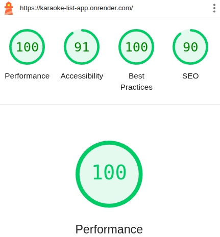

## Karaoke List App
🛠 Fullstack app built with **React**, **Typescript**, **Node.js**, **MongoDb**, **Chakra UI**, and **Open AI**. 📆 Created in 2025.

### Optimizations Score

### 💬 Description
 If you ever went to a karaoke place and realised you cannot find or decide upon which songs to sing, this app is for you... Never be blank again! 😉

### 📡 APIs Used
  - [MusicBrainz](https://musicbrainz.org/doc/MusicBrainz_API)
  - [OpenAi](https://platform.openai.com/docs/overview)

### ⚙️ Full Tech Stack
* Main:
  * React
  * TypeScript
  * Node.js
  * MongoDb
  * Chakra UI
  * React Query
  * React Router
  * React Hooks
  * Axios
  * Zod
  * Open AI

* Other dependencies:
  - cors
  - bcrypt
  - dotenv
  - express
  - express-mongo-sanitize
  - helmet
  - jsonwebtoken
  - mongoose
  - resend
  - xss-clean
  - cookie-parser

### 🎨 Features
  - Authentication
    - Login
    - Register
    - Logout
    - Account Verification
    - Password Reset
    - Send Emails for Account Verification and Password Reset
    - Sessions
  - In-app features
    - Create lists (all, sang, favs, duet, blacklist, next event)
    - Add songs to lists
    - Creatable Select with AI powered results 🪄
    - AI powered suggestions when unknown artist or song 🪄
    - Move songs between lists
    - Remove songs from lists
    - Songs sang history
    - Delete songs from list
    - Number plays

And more to come...
